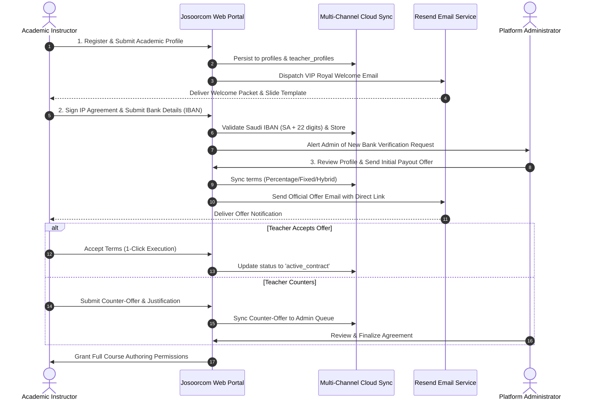
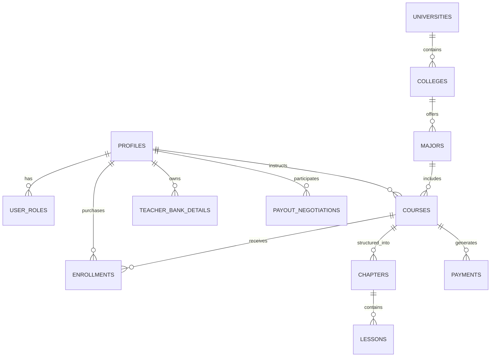
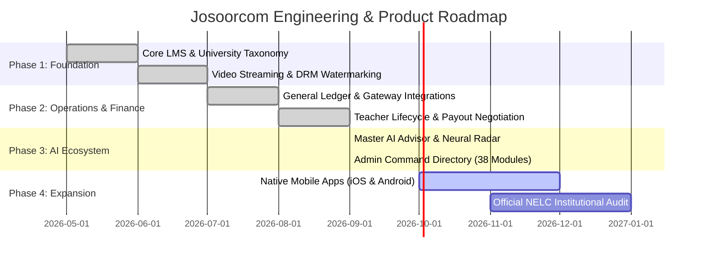

# Product Requirements Document (PRD)
## Josoorcom (منصة جسوركم) Enterprise Academic & EdTech Ecosystem

---

**Document Status:** Approved & Authoritative  
**Target Market:** Kingdom of Saudi Arabia (Higher Education / University Sector)  
**Primary Language & Direction:** Arabic (RTL First) with Full English (LTR) Localization  
**Brand Identity & Styling:** Josoorcom Royal Theme (Pure Light Backgrounds, Royal Navy `#0F172A`, Josoorcom Gold `#D4AF37`, Emerald Highlights `#10B981`, Slate `#64748B`)  
**Architecture:** Multi-Tenant Role-Based Cloud Architecture (Student, Instructor, Admin, Secretary, Production)  
**Security & Accreditation:** National eLearning Center (NELC) Compliance, DRM Screen-Capture Protection, PostgreSQL Row Level Security (RLS)  

---

## 1. Executive Summary & Strategic Vision

### 1.1 Vision Statement
**Josoorcom (جسوركم)** is the premier Saudi higher-education digital learning ecosystem designed to bridge the gap between academic university curricula and student excellence. Tailored specifically for Saudi university students across major institutions (such as King Abdulaziz University, King Saud University, Umm Al-Qura, Imam Mohammad Ibn Saud Islamic University, and Qassim University), Josoorcom provides hyper-targeted, high-fidelity academic courses, interactive problem sets, continuous assessments, and direct academic faculty guidance.

### 1.2 Mission Statement
To democratize premier university tutoring and academic test preparation across all Saudi universities by providing an intuitive, secure, and compliant learning infrastructure that empowers academic professors to monetize their expertise while providing undergraduate students with mastery over calculus, general chemistry, nuclear medicine, physics, linear algebra, and specialized STEM subjects.

### 1.3 Key Value Propositions
1. **Curriculum Hyper-Alignment:** Unlike generic global platforms (e.g., Coursera or Udemy), courses are mapped directly to specific Saudi universities, colleges, departments, subject codes (e.g., `MTH1104`, `CHM2302`, `PHYS1101`), and active semester plans.
2. **End-to-End Teacher Lifecycle Suite:** Comprehensive onboarding, contract digitization, Saudi IBAN verification, multi-channel profit negotiation, and automated payout disbursements.
3. **Multi-Model Autonomous AI Operations:** A suite of 6 synchronized neural agents led by the Master Executive Advisor with full database omniscience and zero-hallucination policies.
4. **Institutional Security & DRM:** Real-time screen capture detection, anti-piracy deterrence, session binding, and NELC compliance telemetry.
5. **Robust Accounting & Financial Orchestration:** Double-entry ledger, automated checkout with split payments (Tabby/Tamara), real-time abandoned transaction recovery, and 1-click payout settlements.

---

## 2. User Personas & Role-Based Access Control (RBAC)

The platform operates on a strictly partitioned multi-tenant RBAC architecture powered by Supabase Authentication and PostgreSQL `user_roles` mapping.

```
                         ┌─────────────────────────┐
                         │   Josoorcom Platform    │
                         └────────────┬────────────┘
                                      │
         ┌──────────────┬─────────────┼─────────────┬──────────────┐
         ▼              ▼             ▼             ▼              ▼
   ┌───────────┐  ┌───────────┐ ┌───────────┐ ┌───────────┐  ┌───────────┐
   │  Student  │  │Instructor │ │   Admin   │ │ Secretary │  │Production │
   └───────────┘  └───────────┘ └───────────┘ └───────────┘  └───────────┘
```

### 2.1 Persona Breakdown

| Role | Primary User Persona | Core Objectives | Primary Interfaces |
| :--- | :--- | :--- | :--- |
| **Student** (`student`) | Undergraduate university student enrolled in Saudi institutions. | Master university subjects, watch structured lectures, submit assignments, take quizzes, generate verified certificates, request custom course content. | Student Dashboard (`/dashboard`), Course Details (`/course/:id`), Lesson Player (`/learn/:courseId`), Study Planner, Certificates. |
| **Instructor** (`instructor`) | Academic professor, university lecturer, or verified subject-matter expert. | Complete onboarding pipeline, negotiate payout model, structure chapters and video lectures, monitor student analytics, resolve questions, withdraw earnings. | Instructor Onboarding (`/teacher/onboarding`), Negotiation Room (`/instructor/negotiation`), Instructor Dashboard, Question Bank, Payouts. |
| **Super Admin** (`admin`) | Platform owners, academic deans, and executive controllers. | Strategic governance, financial ledger reconciliation, teacher verification, course approvals, emergency risk broadcasting, AI neural control. | Admin Dashboard (`/admin`), Admin Hub (38-command directory), AI Control Center, Mega AI Ops Hub, Financial Dashboard. |
| **Secretary** (`secretary`) | Administrative coordinator. | Coordinate custom course requests, student inquiries, teacher assignments, and institutional partnerships. | Administrative Workflow Dashboard, Support Chats, Requests Management. |
| **Production** (`production`) | Audio/video engineer and media specialist. | Verify video recording standards (1080p, noise-free audio), upload high-bitrate lectures via Cloudflare/Bunny/R2, format slide templates. | Video Uploader, Multi-Quality Transcoder, Content Approvals. |

---

## 3. Information Architecture & Navigation

The platform provides dedicated, localized RTL/LTR responsive navigation tailored to each role.

### 3.1 Public Portal
- **Landing Page (`/`):** Hero section, university picker, featured courses, curriculum search, high-converting preview videos, student testimonials, and instructor recruitment CTA.
- **Course Catalog (`/courses`):** Filter by Institution, College, Major, Academic Term, and Price (Free vs. Paid).
- **Course Landing & Preview Page (`/course/:id`):** Course syllabus, professor credentials, lesson directory, free preview lessons, reviews, and dynamic checkout drawer.
- **Custom Course Request (`/custom-course-request`):** Student form to request tailored courses for unlisted university subjects.
- **Authentication (`/login`, `/signup`, `/reset-password`):** Secure email/password and OTP authentication with auto-redirect to role dashboard.

### 3.2 Student Dashboard Ecosystem
- **Overview:** Enrolled courses, overall completion rate, upcoming assignment deadlines, and gamification points/badges.
- **My Courses:** Active courses, completed courses, and resume lesson shortcuts.
- **Interactive Lesson Player:** Multi-quality video streaming, KaTeX-rendered mathematical summaries, lesson notes, and synchronized transcript reader.
- **Assignments & Question Bank:** Upload homework submissions, track grading status, and attempt practice quizzes.
- **Study Planner & Calendar:** Semester schedule planner with study alarms and milestones.
- **My Payments:** Transaction history, digital VAT invoices, and installment status.
- **Certificates:** Cryptographically verifiable digital completion certificates.
- **Support Chat:** Direct real-time communication with academic tutors and administration.

### 3.3 Instructor Dashboard & Lifecycle Suite
- **Onboarding Hub (`/teacher/onboarding`):** 5-step guided wizard (Profile Setup -> Media Equipment Check -> Policy Agreement -> Bank Account Verification -> Profit Model Selection).
- **Negotiation Room (`/instructor/negotiation`):** Real-time counter-offer portal with admin notes, percentage/fixed profit terms, and 1-click contract execution.
- **Teaching Resource Center:** Direct downloads for official Josoorcom PowerPoint/GoodNotes 16:9 slide templates, studio setup guides, and pedagogy manuals.
- **Course Builder:** Chapter organizer, video uploader (Cloudflare/Bunny/R2), PDF attachment binder, and quiz generator.
- **Instructor AI Co-Pilot:** Gemini-powered assistant to generate academic quiz questions, format LaTeX formulas, and structure syllabi.
- **Earnings & Bank Payouts:** Real-time revenue share tracker, pending balance, and payout disbursement status.

### 3.4 Admin Executive Command Center (38-Command Directory)
The Admin Command Center in `AdminHub.tsx` organizes the entire operation into 6 prestigious executive categories:

```
                            ┌─────────────────────────────────┐
                            │    Admin Executive Command      │
                            │        (38 Core Modules)        │
                            └────────────────┬────────────────┘
                                             │
      ┌─────────────────┬────────────────────┼───────────────────┬──────────────────┐
      ▼                 ▼                    ▼                   ▼                  ▼
┌───────────┐     ┌───────────┐        ┌───────────┐       ┌───────────┐      ┌───────────┐
│Faculty &  │     │Academic & │        │Students & │       │Finance &  │      │AI & Neural│
│Teachers   │     │Curricula  │        │Growth     │       │Accounting │      │Operations │
│(6 Modules)│     │(8 Modules)│        │(5 Modules)│       │(10 Modules│      │(2 Modules)│
└───────────┘     └───────────┘        └───────────┘       └───────────┘      └───────────┘
                                                                                    │
                                                                                    ▼
                                                                              ┌───────────┐
                                                                              │Security & │
                                                                              │Governance │
                                                                              │(7 Modules)│
                                                                              └───────────┘
```

1. **Faculty & Teachers (6 Modules):**
   - `teachers-onboarding`: Pipeline tracking, bank account verification, contract inspection.
   - `payout-negotiations`: Profit-sharing room, hybrid offer builder, counter-offer auditor.
   - `instructor-payouts`: Monthly dues, 1-click Saudi IBAN copy, bank disbursement settlement.
   - `instructor-settings`: Global default commission percentages, onboarding rules.
   - `instructor-specialties`: Academic rank classifications, faculty credentials.
   - `instructor-detail`: Comprehensive professor dossier, student reach, earnings history.

2. **Academic & Curricula (8 Modules):**
   - `courses`: Master catalog management, pricing, chapter hierarchy.
   - `course-approvals`: Quality review queue for instructor-submitted drafts.
   - `requests`: Custom course requests triage and instructor assignment.
   - `universities`: Partner Saudi institutions configuration.
   - `colleges`: Academic faculties linked to universities.
   - `majors`: Degree programs linked to colleges.
   - `terms`: Academic semesters, seasonal schedules, and policies.
   - `video-analytics`: Lecture watch duration, bandwidth consumption, drop-off curves.

3. **Students & Growth (5 Modules):**
   - `users`: User directory, permission management, device session resets, bans.
   - `preview-students`: Hot leads intelligence, preview video watchers, conversion funnels.
   - `user-insights`: Student engagement telemetry, peak study hours, cohort retention.
   - `students-by-major`: Demographic distribution across Saudi university majors.
   - `student-detail`: Full transcript, payment history, assignments, and certificates.

4. **Finance & Accounting (10 Modules):**
   - `financial-dashboard`: Executive cash flow, revenue vs. expenses, net profitability.
   - `accounting`: Double-entry general ledger, debit/credit audit trail.
   - `payments`: Processed transactions, payment gateways, electronic receipts.
   - `live-payments`: Real-time WebSocket payment alerts ticker.
   - `abandoned-payments`: Abandoned cart intelligence with 24h+ recovery triggers.
   - `payment-methods`: Gateway toggle per course (Apple Pay, Mada, Cards).
   - `monthly-installments`: Tabby & Tamara split payment monitoring.
   - `withdrawals`: Teacher withdrawal requests review and execution.
   - `student-refunds`: Drop-out refunds and ledger adjustments.
   - `coupons`: Promotional discount campaigns, redemption caps.

5. **AI Command & Neural Automation (2 Modules):**
   - `ai-control`: Master AI executive orchestrator, system prompt tuning, action executor.
   - `mega-ai-ops`: Neural telemetry stream, ping monitor, live platform emergency risk radar.

6. **Security, Governance & Operations (7 Modules):**
   - `nelc`: National eLearning Center compliance audit and metrics export.
   - `capture-attempts`: Screen capture and DRM violation logs.
   - `support`: Live student and teacher ticket management.
   - `reports`: Exportable business intelligence (PDF/Excel).
   - `notifications`: Push and email broadcast system.
   - `logs`: System event logs and administrative audit trail.
   - `workflow`: Cross-departmental task board (Admin <-> Secretary <-> Production).
   - `general`: Branding, SMTP credentials, site-wide parameters.

---

## 4. Functional Specifications by Domain

### 4.1 Teacher Lifecycle & Onboarding Workflow

The teacher lifecycle is engineered to guarantee quality, legal compliance, and reliable financial settlement.



#### Detailed Lifecycle Stages
1. **Stage 1: Registration & Academic Credentials (`registered`)**
   - Collects full name (Arabic & English), email, mobile number with country code, university institution, academic degree (Professor, Associate, Assistant, Lecturer), and years of teaching experience.
   - Automatically dispatches VIP Royal Welcome Email via Resend with links to official teaching slide templates.
2. **Stage 2: Teaching Resources & Video Equipment Standards (`media_setup`)**
   - Outlines 1080p full HD video requirements, dedicated external microphone usage, and zero-reverb audio guidelines.
   - Provides direct download links for the official Josoorcom 16:9 branded presentation template (`.pptx`).
3. **Stage 3: Intellectual Property & Digital Policy Contract (`policy_accepted`)**
   - Legally binding agreement covering course content exclusivity, 24-48h student interaction SLA, and platform anti-disintermediation.
   - Captures digital signature, timestamp (UTC), IP address, and generates an automated PDF contract artifact.
4. **Stage 4: Saudi Banking & IBAN Verification (`bank_submitted`)**
   - Captures Bank Name, Account Holder Name, Saudi IBAN, and Account Number.
   - Strict client-side and server-side validation: must match regex `/^SA\d{22}$/` (exactly 24 alphanumeric characters).
   - Formats IBAN into 4-character blocks for visual legibility (`SA00 0000 0000 0000 0000 0000`).
   - Admin verification toggle (`verified_by_admin`) with 1-click IBAN copy in payouts view.
5. **Stage 5: Profit Model Selection & Payout Negotiation Room (`payout_selected` / `negotiating`)**
   - Three available revenue models:
     - **Percentage Model (نسبة مئوية):** Instructor receives e.g. 60%-75% of net course sales.
     - **Fixed Model (مبلغ مقطوع):** Instructor receives a fixed compensation upon course delivery (e.g. 5,000 SAR).
     - **Hybrid Model (نموذج هجين):** Combined fixed base fee plus a smaller revenue share (e.g. 2,000 SAR + 30%).
   - Dedicated negotiation room (`/instructor/negotiation`) with real-time counter-offer capabilities and administrative note justification.
6. **Email Deduplication & VIP Royal Corporate Templates:**
   - Multi-tier deduplication store prevents redundant email dispatch within a 45-second debounce window.
   - Templates feature an aristocratic Josoorcom navy and gold `#D4AF37` aesthetic, clear call-to-action buttons, and masked IBAN displays.

---

### 4.2 Academic Structure & Content Delivery Engine

#### Higher Education Taxonomy Hierarchy
```
Institution (University) ➔ College ➔ Major ➔ Academic Term ➔ Course ➔ Chapter ➔ Lesson
```
- **Dynamic University Hierarchy:** All course assets are strictly partitioned under official Saudi universities (e.g., King Abdulaziz University -> Faculty of Science -> Physics Department).
- **Multi-Cloud Video Architecture:**
  - **Cloudflare Stream:** Adaptive bitrate streaming (HLS/DASH), automatic thumbnail generation, and regional edge caching in Saudi Arabia.
  - **Bunny.net Stream:** High-performance fallback CDN with instant transcoding.
  - **Cloudflare R2 Multipart Storage:** S3-compatible, zero-egress-fee storage for raw master video files, course slide decks, and PDF homework files.
- **Lesson Player & Interactive Experience:**
  - KaTeX & LaTeX rendering for complex mathematical, chemical, and physical formulas directly in lesson notes and transcripts.
  - Interactive synchronized transcript viewer allowing students to jump to specific timestamps.
  - Gated video access ensuring students complete prerequisite lessons before advancing.
  - Free preview lessons (`is_preview = true`) engineered as top-of-funnel lead capture.

---

### 4.3 Financial, Commerce & Accounting Engine

#### General Ledger & Double-Entry Accounting
Every financial interaction creates immutable, balanced ledger records:
- **Student Enrollment:** Debits Customer Gateway Receivable / Cash; Credits Course Sales Revenue.
- **Instructor Revenue Share:** Debits Instructor Expense; Credits Instructor Payable.
- **Platform Fee:** Credits Platform Net Operating Margin.
- **Payout Disbursement:** Debits Instructor Payable; Credits Platform Bank Account.

#### Payment Gateway Integrations
- Supported Payment Gateways:
  - **Mada (مدى):** Mandatory national debit card network.
  - **Apple Pay:** Instant 1-click mobile checkout.
  - **Visa & Mastercard:** International and domestic credit cards.
  - **Tabby & Tamara:** Split into 4 monthly interest-free installments.
  - **AlinmaPay:** Direct Saudi bank payment gateway.
- **Abandoned Checkout Telemetry:** Captures transactions pending for >24 hours with automated recovery triggers, email notifications, and discount coupons.
- **Instructor Payout Workflow:**
  - Dues calculation based on verified enrollment sales minus refunds.
  - Admin inspection interface with 1-click IBAN copy.
  - Payout confirmation modal requiring transaction reference ID and transfer slip upload.

---

### 4.4 Autonomous AI Operations & Neural Command Suite

Josoorcom incorporates an enterprise multi-agent AI architecture powered by Google DeepMind's Gemini models with robust client-side streaming and fallback proxies.

```
                         ┌────────────────────────────────────────┐
                         │   Executive Master AI Orchestrator     │
                         │   (Gemini Pro / Flash Hybrid Engine)   │
                         └───────────────────┬────────────────────┘
                                             │
      ┌─────────────────┬────────────────────┼───────────────────┬──────────────────┐
      ▼                 ▼                    ▼                   ▼                  ▼
┌───────────┐     ┌───────────┐        ┌───────────┐       ┌───────────┐      ┌───────────┐
│  Sales &  │     │Instructor │        │ Financial │       │NELC & DRM │      │ Automated │
│  Leads    │     │ Academic  │        │  Ledger   │       │ Security  │      │  Support  │
│Specialist │     │ Co-Pilot  │        │   Guard   │       │  Sentry   │      │ Assistant │
└───────────┘     └───────────┘        └───────────┘       └───────────┘      └───────────┘
```

#### The 6 Neural Agent Nodes
1. **Executive Master AI Orchestrator (المستشار التنفيذي العام):**
   - Real-time full context ingestion: authoritative roster of registered faculty, courses, syllabus descriptions, active coupons, and general ledger totals.
   - Zero-Hallucination Policy: Bound strictly to live Supabase database entities.
   - Autonomous Action Execution: Can emit structured commands in the syntax `[[ACTION:action_type:payload_json]]` to create coupons, assign instructor tasks, toggle AI agents, or approve courses.
2. **Sales & Growth Specialist (وكيل المبيعات والفرص البيعية):**
   - Telemetry watcher analyzing student preview video retention and converting free previewers into paid subscribers.
3. **Instructor Academic Co-Pilot (مساعد المعلم الأكاديمي):**
   - Embedded directly in the instructor dashboard with KaTeX support to assist professors in drafting syllabi, generating quiz questions, and formatting equations.
4. **Financial Ledger & Negotiation Guard (مراقب المالية والمقايضة):**
   - Verifies payout calculation integrity, validates IBAN checksums, and monitors ledger balance consistency.
5. **Accreditation & NELC Security Sentry (وكيل الاعتماد والأمان NELC):**
   - Monitors screen capture attempts and verifies platform adherence to National eLearning Center standards.
6. **Automated Support Assistant (وكيل الدعم والرد الفوري):**
   - Resolves student technical tickets with sub-1.5s latency on a 24/7 schedule.

#### Platform Emergency Risk & Outage Alert System
- Admins or the Master AI can broadcast instant platform-wide emergency alerts (`trigger_emergency_alert`) with severity levels: *Warning*, *Critical*, or *Emergency*.
- Broadcasts pulsating visual alert banners across all admin views and dispatches notifications to all platform administrators.
- 1-click emergency resolution and system recovery logging.

---

### 4.5 Security, Governance & DRM Protection

1. **Screen Capture & Piracy Deterrence:**
   - Active listener detecting screen recording software, screenshot shortcuts, and unauthorized display mirroring.
   - Displays full-screen security overlays blocking video playback when capture is detected.
   - Logs timestamp, user ID, IP address, and course ID to `screen_capture_attempts`.
   - Automated account suspension threshold upon repeated violations.
2. **Dynamic Student Watermarking:**
   - Renders semi-transparent floating watermarks over video lectures displaying the enrolled student's email, phone number, and IP address to deter external camera recording.
3. **National eLearning Center (NELC) Alignment:**
   - Audit trail logging, course completion tracking, and educational quality indicators aligned with Kingdom accreditation criteria.
4. **Database Row Level Security (RLS):**
   - Strict RLS policies enforcing tenant isolation: students access only enrolled courses and their own submissions; instructors access only their authored courses and earnings; administrators have supervised platform-wide oversight.

---

## 5. Data Architecture & Entity Relationship Schema

The database is built on PostgreSQL 14.5 hosted on Supabase with foreign keys, composite indexes, and cascading constraints.

### 5.1 Core Database Tables (Summary of 50+ Tables)



| Table Name | Primary Keys & Foreign Keys | Core Purpose |
| :--- | :--- | :--- |
| `profiles` | `id` (PK, FK `auth.users`) | Central identity profile (name, Arabic name, email, phone, university, specialty). |
| `user_roles` | `id` (PK), `user_id` (FK `profiles.id`) | Role mapping (`student`, `instructor`, `admin`, `secretary`, `production`). |
| `universities` | `id` (PK) | Registered Saudi universities and partner educational entities. |
| `colleges` | `id` (PK), `university_id` (FK) | Academic colleges linked to universities. |
| `majors` | `id` (PK), `college_id` (FK) | Specialized academic majors and degree tracks. |
| `terms` | `id` (PK) | Academic semester definitions (Fall, Spring, Summer) and date boundaries. |
| `courses` | `id` (PK), `instructor_id` (FK `profiles.id`) | Master course catalog with price, approval status, and subject codes. |
| `chapters` | `id` (PK), `course_id` (FK `courses.id`) | Course syllabus modules/units. |
| `lessons` | `id` (PK), `course_id` (FK `courses.id`) | Lecture videos, duration, preview flags, and transcript bindings. |
| `enrollments` | `id` (PK), `user_id` (FK), `course_id` (FK) | Active student course subscriptions and progress metrics. |
| `payments` | `id` (PK), `user_id` (FK), `course_id` (FK) | Gateway transaction records with amounts, methods, and statuses. |
| `monthly_installments` | `id` (PK), `payment_id` (FK) | Tabby/Tamara split payment schedules and settlement logs. |
| `payout_negotiations` | `id` (PK), `teacher_id` (FK `profiles.id`) | Revenue negotiation records, proposed percentages, and counter-offers. |
| `teacher_bank_details` | `id` (PK), `teacher_id` (FK `profiles.id`) | Saudi IBAN, bank name, account holder name, and verification state. |
| `withdrawal_requests` | `id` (PK), `instructor_id` (FK `profiles.id`) | Payout disbursement requests and transfer documentation. |
| `screen_capture_attempts` | `id` (PK), `user_id` (FK `profiles.id`) | DRM violation events, client telemetry, and security incident logs. |
| `platform_settings` | `key` (PK) | Global system configuration, AI model prompts, and emergency alerts. |
| `support_chats` | `id` (PK), `user_id` (FK `profiles.id`) | Real-time support sessions and academic inquiry threads. |
| `certificates` | `id` (PK), `user_id` (FK), `course_id` (FK) | Cryptographically verifiable course graduation credentials. |

---

## 6. Technical Stack & Infrastructure Architecture

```
┌────────────────────────────────────────────────────────────────────────┐
│                          Client Layer (Browser)                        │
│   React 18 • TypeScript • Tailwind CSS • Radix UI • KaTeX • Vite       │
└───────────────────────────────────┬────────────────────────────────────┘
                                    │ HTTPS / WSS
┌───────────────────────────────────▼────────────────────────────────────┐
│                    CDN & Edge Acceleration Layer                       │
│    Cloudflare Edge Network • Vercel Global Edge • DNS & SSL Security    │
└───────────┬───────────────────────┬────────────────────────┬───────────┘
            │                       │                        │
            ▼                       ▼                        ▼
┌──────────────────────┐ ┌──────────────────────┐ ┌──────────────────────┐
│  Serverless Backend  │ │  Media & Video CDN   │ │ Autonomous AI Engine │
│  Vercel Serverless   │ │  Cloudflare Stream   │ │ Google DeepMind      │
│  Resend API (Emails) │ │  Bunny.net Stream    │ │ Gemini 2.5 Flash/Pro │
│  Supabase Edge Funcs │ │  Cloudflare R2 (S3)  │ │ KaTeX Math Formatter │
└───────────┬──────────┘ └──────────────────────┘ └──────────────────────┘
            │
            ▼
┌────────────────────────────────────────────────────────────────────────┐
│                       Primary Database Layer                           │
│     Supabase PostgreSQL 14.5 • Connection Pooling • Zero Trust RLS     │
└────────────────────────────────────────────────────────────────────────┘
```

| Layer | Technology | Justification & Architectural Role |
| :--- | :--- | :--- |
| **Frontend Framework** | React 18 + TypeScript | Component-based, strictly typed, high-performance rendering. |
| **Build & Tooling** | Vite | Ultra-fast HMR and optimized production bundling with code-splitting. |
| **Styling & UI Kit** | Tailwind CSS + Radix UI + Lucide Icons | Royal Josoorcom design system, accessible primitives, native RTL support. |
| **State & Data Fetching**| TanStack Query v5 (React Query) | Intelligent caching, optimistic updates, automatic refetching, and stale-time controls. |
| **Database & Auth** | Supabase (PostgreSQL 14.5) | Relational integrity, native JWT authentication, and declarative Row Level Security. |
| **Video Infrastructure** | Cloudflare Stream + Bunny.net + Cloudflare R2 | Multi-CDN adaptive bitrate video delivery with zero egress storage costs. |
| **Serverless Functions** | Vercel Serverless Functions (`api/`) | Secure email dispatch, webhooks, and rate-limiting execution without server overhead. |
| **Email Delivery** | Resend API | Reliable transactional email delivery with custom HTML corporate templates. |
| **Mathematical Engine**| KaTeX & LaTeX | Fast, client-side rendering of university-level mathematical and scientific formulas. |
| **AI LLM Engine** | Google Gemini 2.5 Flash / Pro Hybrid | Real-time multi-agent reasoning, high token throughput, and low-latency streaming. |

---

## 7. Non-Functional Requirements (NFRs)

### 7.1 Performance & Latency
- **First Contentful Paint (FCP):** < 1.2 seconds on standard 4G connections in Saudi Arabia.
- **Time to Interactive (TTI):** < 2.5 seconds on desktop and mobile browsers.
- **Video Playback Startup Time:** < 800ms via localized Cloudflare Middle East edge nodes.
- **AI Streaming Latency:** Time-to-first-token < 600ms for autonomous executive agents.

### 7.2 Security & Data Privacy
- **Saudi Data Privacy Law (PDPL):** Student and teacher data encrypted in transit (TLS 1.3) and at rest (AES-256).
- **Authentication Security:** Secure HTTP-only cookie session handling, brute-force protection, and optional multi-factor authentication.
- **Financial Compliance:** PCI-DSS Level 1 compliant gateway processing; no raw credit card numbers stored on platform databases.

### 7.3 High Availability & Fault Tolerance
- **System Uptime SLA:** 99.9% monthly availability excluding scheduled maintenance windows.
- **Automated Failover:** Dual-proxy architecture for AI models (Primary Gemini Endpoint -> Edge Fallback Proxy).
- **Database Backups:** Daily automated point-in-time recovery snapshots with multi-region redundancy.

### 7.4 Localization & Accessibility
- **RTL/LTR Fidelity:** Perfect right-to-left layout alignment for Arabic typography (Cairo font), with instant left-to-right toggle for English.
- **WCAG 2.1 AA Compliance:** Color contrast ratios strictly > 4.5:1, screen reader ARIA landmarks, and keyboard navigation.

---

## 8. Release Roadmap & Implementation Milestones



- **Phase 1: Academic Foundation (Completed):** Multi-university hierarchy, course builder, Cloudflare video integration, DRM watermarking, and student assessment engine.
- **Phase 2: Financial Orchestration & Teacher Lifecycle (Completed):** Double-entry accounting ledger, Mada/Apple Pay checkout, Tabby/Tamara installments, teacher onboarding pipeline, IBAN validation, and payout negotiation room.
- **Phase 3: Autonomous AI & Executive Command Hub (Completed):** Multi-agent AI ecosystem, Master Executive Advisor with live database sync, Mega AI Operations Hub, and 38-module administrative directory.
- **Phase 4: Mobile Ecosystem & Official NELC Certification (Active):** Native iOS and Android application deployment using React Native / Capacitor, and final accreditation certification with the National eLearning Center.

---

## 9. Key Performance Indicators (KPIs) & Success Metrics

| Dimension | Metric | Measurement Method | Target Objective |
| :--- | :--- | :--- | :--- |
| **Student Engagement** | Course Completion Rate | % of enrolled students finishing > 80% of lessons | > 65% across paid courses |
| **Student Conversion** | Preview-to-Paid Funnel | % of preview watchers purchasing within 7 days | > 18% conversion rate |
| **Teacher Operations** | Onboarding Turnaround | Time from registration to signed agreement | < 48 hours average |
| **Financial Health** | Payout Accuracy & Reconciliation | Discrepancy between ledger and bank settlements | 0.00% variance |
| **Technical Quality** | Video Rebuffering Ratio | Total rebuffering time divided by watch time | < 0.4% across all streams |
| **AI Reliability** | Hallucination Frequency | Master AI reporting unverified faculty or numbers | 0 reported incidents |

---

*Document Author: Josoorcom Platform Architecture & Product Engineering Team*  
*Classification: Enterprise Confidential / Master Product Document*
